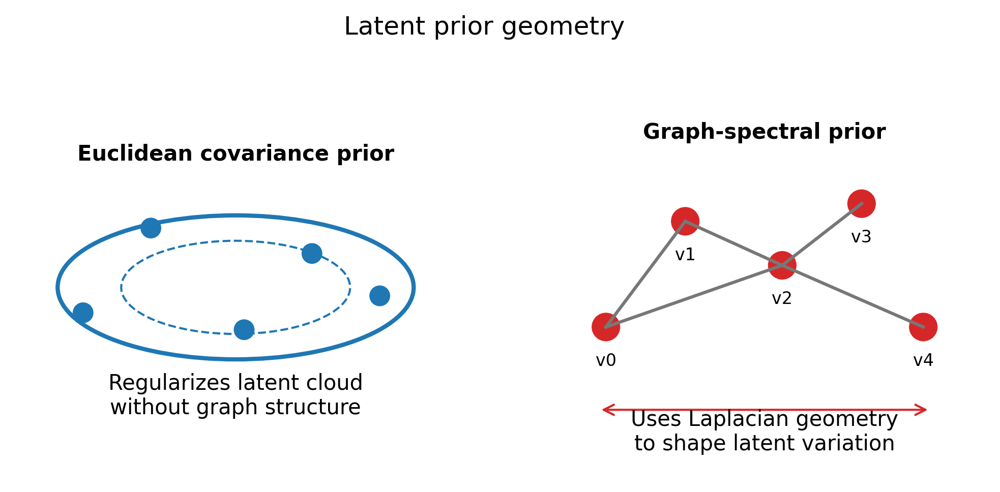
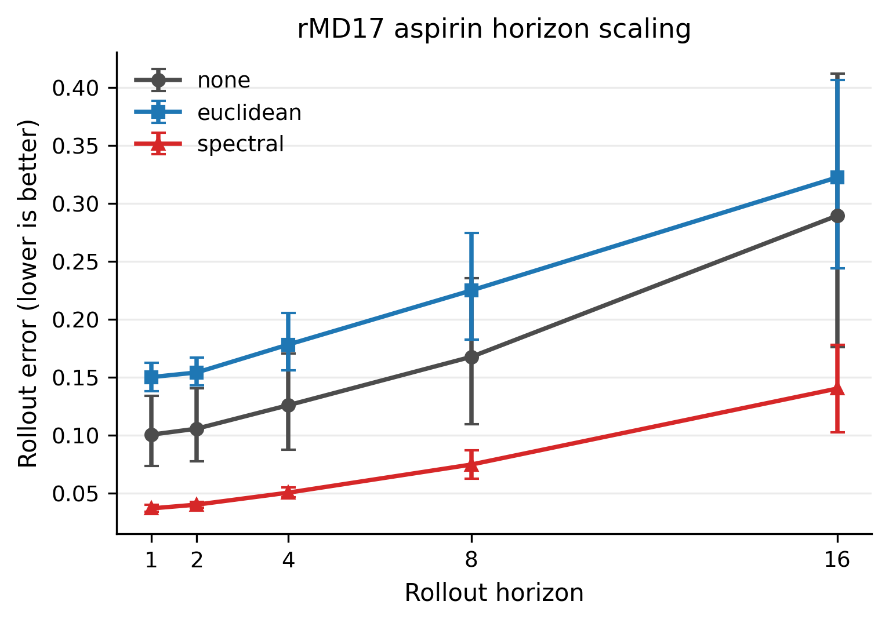
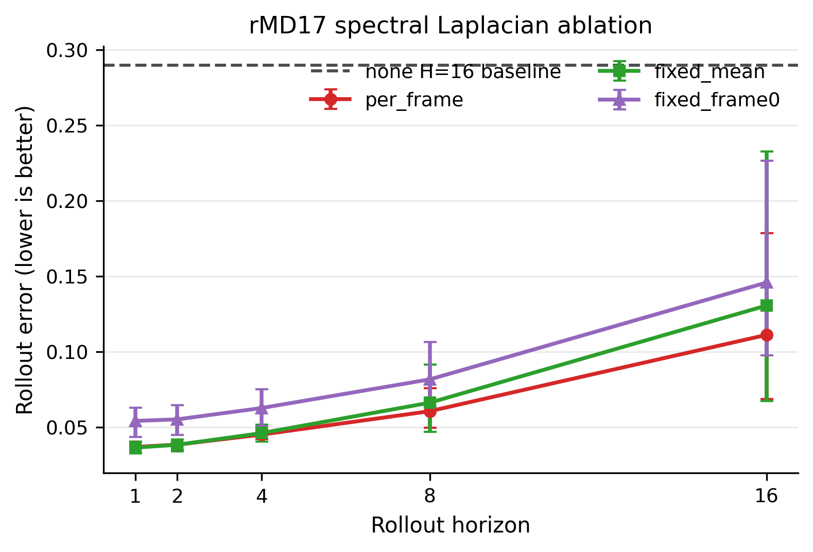
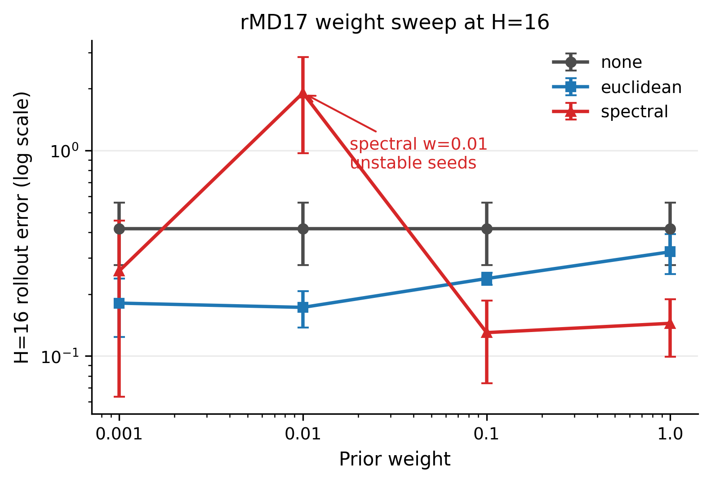
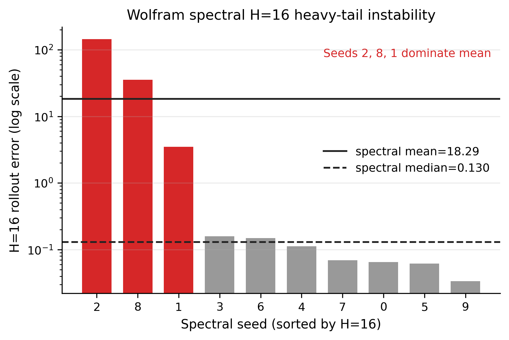

# Stability-Dependent Latent Prior Geometry for Structured World Models

## Abstract

Structured world models require latent representations that remain predictive under multi-step rollout. This paper studies whether explicit latent geometry priors improve long-horizon prediction in relational domains. We compare no latent prior, a Euclidean covariance prior, and a spectral graph-Laplacian prior in molecular and synthetic structured environments. The central finding is that latent prior geometry is domain-specific and stability-dependent. Under the current rMD17 aspirin evaluation protocol, the spectral prior improves H=16 rollout error from 0.290 with no prior and 0.323 with a Euclidean prior to 0.140, corresponding to 51.5% improvement over no prior and 56.5% improvement over Euclidean. Fixed-Laplacian ablations preserve much of the gain, indicating that the result is not solely attributable to per-frame Laplacian recomputation. A prior-weight sweep further shows that Euclidean regularization is not intrinsically harmful: when tuned, it improves over no prior, while the best spectral setting still outperforms the best Euclidean setting. However, a completed Wolfram flat 200-epoch comparison provides a boundary case: Euclidean has the best H=16 mean, while the spectral prior exhibits heavy-tailed long-horizon instability. These results support a practical conclusion for applied intelligent systems: spectral priors can be powerful when graph geometry aligns with dynamics, but they are not universally superior and must be evaluated for long-horizon stability.

## 1. Introduction

World models for intelligent systems must support prediction over multiple time steps. In structured domains, such as molecular trajectories or graph-like symbolic dynamics, the geometry of the learned latent space can determine whether errors compound smoothly or explode under rollout. A one-step transition model may appear accurate while still producing unstable long-horizon behavior.

This paper studies latent priors for structured world models. We compare three choices: no latent prior, a Euclidean covariance prior, and a spectral graph-Laplacian prior. The Euclidean prior regularizes the latent representation without imposing explicit graph geometry. The spectral prior uses relational structure to shape latent variation. We evaluate these priors on rMD17 molecular rollout and on a synthetic Wolfram flat relational-dynamics setting.

The results are intentionally not framed as a universal victory for one prior. Instead, they show that latent prior geometry depends on domain alignment and stability. Under the current rMD17 aspirin evaluation protocol, the spectral prior is strongly beneficial at H=16. In the Wolfram flat 200-epoch comparison, spectral regularization is not uniformly bad, but it produces a heavy-tailed failure mode in which a few seeds explode at long horizon and dominate the mean.

The thesis is therefore: latent prior geometry is domain-specific and stability-dependent. Spectral priors can substantially improve structured molecular rollout when aligned with relational dynamics, but they can also destabilize long-horizon prediction when the geometry or optimization basin is misaligned.

Our contributions are:

1. We provide an applied evaluation of Euclidean and spectral latent priors for structured world models.
2. We show that, under the current protocol, spectral priors strongly improve rMD17 aspirin H=16 rollout relative to no prior and Euclidean regularization.
3. We use fixed-Laplacian controls to show that the rMD17 gain is not solely due to per-frame Laplacian recomputation.
4. We show through a prior-weight sweep that Euclidean regularization is useful when tuned, while the best spectral setting still outperforms the best Euclidean setting on rMD17 aspirin.
5. We identify a Wolfram flat boundary case where Euclidean has the best H=16 mean and spectral priors exhibit heavy-tailed long-horizon instability.

Figure 1 summarizes the conceptual distinction between Euclidean and spectral latent priors.



**Figure 1.** Conceptual comparison of Euclidean and spectral latent priors. The Euclidean prior regularizes the latent cloud without explicit graph structure, whereas the spectral prior shapes latent variation using graph Laplacian geometry.

## 2. Related Work

### 2.1 World Models and Long-Horizon Rollout

World models learn predictive representations of environment dynamics for planning, control, or simulation. In model-based reinforcement learning and latent dynamics modeling, long-horizon rollout quality is often more important than one-step prediction accuracy because small transition errors can compound over time [Hansen2024TDMPC2]. Our work follows this applied perspective: the primary metric is not H=1 prediction, but H=16 rollout stability.

### 2.2 Euclidean Latent Priors and JEPA-Style Regularization

Joint embedding predictive architectures and related predictive latent-space methods use representation objectives that avoid direct reconstruction while maintaining useful predictive structure [LeCun2022], [BalestrieroLeCun2025]. Euclidean covariance and isotropy penalties are one family of regularizers for keeping latent spaces well-conditioned. In this paper, the Euclidean prior is not treated as a straw baseline. The weight sweep shows that Euclidean regularization can improve over no prior when tuned, even though it is not the best prior family for rMD17 aspirin.

This paper should not be read as a refutation of JEPA-style methods. The experiments use known downstream rollout metrics in structured world models and ask a narrower question: when does latent prior geometry improve or destabilize multi-step prediction?

### 2.3 Spectral Graph Priors and Geometric Deep Learning

Geometric deep learning studies neural architectures and inductive biases for data with graph, manifold, group, or relational structure [Bronstein2021GDL]. Spectral graph methods use Laplacian structure to encode smoothness or relational geometry. In a latent world model, such a prior can encourage latent variation to respect graph connectivity. This can be beneficial when the graph captures dynamics-relevant structure, but the same high-gain structure can amplify errors if the graph geometry or optimization basin is misaligned.

### 2.4 Molecular Dynamics Benchmarks

MD17 and revised MD17 are widely used molecular dynamics benchmarks for learning force fields and molecular representations [Chmiela2017MD17], [Christensen2020RMD17]. These datasets are attractive for studying structured world models because molecular frames naturally induce atom-bond relational graphs. Our main molecular evidence comes from rMD17 aspirin; broader molecular claims require additional formal runs on other molecules.

### 2.5 Synthetic Graph Rewriting and Relational Dynamics

Synthetic relational systems, including cellular automata and graph rewriting systems, provide controlled boundary cases for structured prediction [Wolfram2020]. The Wolfram flat experiment in this paper is used in that spirit. It is not a molecular analogue; instead, it tests whether the spectral prior behaves as a universal advantage across a different relational-dynamics regime.

## 3. Method

We train structured world models with a transition or rollout objective augmented by an optional latent prior. The objective can be written as

```text
L = L_transition/rollout + lambda R_prior.
```

Here `L_transition/rollout` is the predictive loss used to train the world model, `R_prior` is the latent regularizer, and `lambda` is the prior weight.

For a transition tuple `(x_t, x_{t+h})`, encoder `f_theta`, and latent transition model `g_phi`, the transition component can be summarized as

```text
z_t = f_theta(x_t)
z_{t+h} = f_theta(x_{t+h})
L_transition = || g_phi(z_t, h) - z_{t+h} ||_2^2,
```

The implementation evaluates rollout in latent space by encoding observed states, rolling the latent dynamics forward, and comparing predicted and target latent states at the requested horizon.

### 3.1 Prior Families

The no-prior setting sets `R_prior = 0`. This is the baseline for asking whether explicit latent geometry is useful.

The Euclidean covariance prior regularizes minibatch latent representations. It is applied at the batch level rather than per sample, because a covariance penalty is degenerate for a single latent vector. Conceptually, this prior encourages a better-conditioned latent cloud without imposing graph structure.

For minibatch latents `Z in R^{B x d}`, the Euclidean covariance prior can be written as

```text
C = cov(Z)
R_Euclidean = || C - I ||_F^2,
```

The implementation applies this covariance penalty at minibatch level, which avoids the degenerate single-sample covariance case.

The spectral Laplacian prior uses relational graph structure. For rMD17, molecular frames are represented as atom-bond graphs. The graph Laplacian defines a structural penalty on latent variation. This prior is more domain-informed than the Euclidean covariance prior, but it can also be higher gain.

For graph Laplacian `L_G` and latent representation matrix `Z`, the spectral prior can be summarized as

```text
R_spectral = tr(Z^T L_G Z).
```

In the implementation, molecular graph Laplacians are projected to the latent dimensionality used by the world model and applied as the spectral graph-smoothness penalty.

### 3.2 Laplacian Modes

We evaluate three Laplacian modes for rMD17 spectral regularization:

- `per_frame`: recompute the Laplacian from the current molecular frame.
- `fixed_mean`: compute a fixed Laplacian by averaging frame-level Laplacians over a prefix of frames.
- `fixed_frame0`: compute a fixed Laplacian from the first frame.

The fixed modes are controls for the possibility that per-frame Laplacian recomputation leaks sample-specific geometric information into the prior. They do not establish that leakage is impossible, but they test whether the spectral gain survives without recomputing the Laplacian from every current sample.

### 3.3 Evaluation Metric

We report rollout error at horizons H=1, 2, 4, 8, and 16. Lower rollout error is better. H=16 is the main long-horizon metric because compounding instability may be invisible at H=1. Strong claims in this paper are therefore tied to H=16 behavior under the current evaluation protocol.

## 4. Experimental Setup

The main molecular experiment is a 10-seed rMD17 aspirin comparison across no prior, Euclidean prior, and spectral prior. The primary metric is mean H=16 rollout error.

The Laplacian ablation evaluates spectral priors under `per_frame`, `fixed_mean`, and `fixed_frame0` modes. The goal is to test whether fixed graph geometry preserves the molecular benefit.

The rMD17 prior-weight sweep compares none, Euclidean, and spectral priors across weights 0.001, 0.01, 0.1, and 1.0 with three seeds per group. This separates prior-family behavior from the choice of prior strength.

The Wolfram flat 10-seed 200-epoch comparison is a synthetic boundary case. It tests whether spectral priors remain advantageous outside the molecular setting.

### 4.1 Statistical Reporting

Means and standard deviations are computed over seeds. Bootstrap confidence intervals are used in figures where available from the aggregate analysis. H=16 is the primary long-horizon metric throughout the paper, and lower rollout error is better.

Paper-ready result tables are collected in `paper/applied_intelligence/tables.md`; the manuscript tables below retain the key numerical comparisons inline.

## 5. Results

### 5.1 rMD17 Aspirin Main Comparison

Under the current evaluation protocol, the completed rMD17 aspirin 10-seed H=16 results are:

| prior | H=16 mean +/- std | n |
| --- | ---: | ---: |
| none | 0.290 +/- 0.203 | 10 |
| Euclidean | 0.323 +/- 0.139 | 10 |
| spectral | 0.140 +/- 0.065 | 10 |

The spectral prior improves over no prior by 51.5% and over Euclidean by 56.5%. This supports the claim that spectral latent geometry is beneficial for aspirin molecular rollout under the current evaluation protocol.

The Euclidean prior is worse than no prior in the main 10-seed comparison. This should not be overinterpreted before considering the weight sweep: the tuned Euclidean prior improves substantially over no prior.



**Figure 2.** rMD17 aspirin rollout error by horizon for no prior, Euclidean prior, and spectral prior. Error bars show bootstrap confidence intervals from the aggregate analysis. Lower rollout error is better.

### 5.2 Laplacian Ablation

The H=16 Laplacian ablation results are:

| Laplacian mode | H=16 mean +/- std | n |
| --- | ---: | ---: |
| per_frame | 0.111 +/- 0.075 | 5 |
| fixed_mean | 0.131 +/- 0.112 | 5 |
| fixed_frame0 | 0.146 +/- 0.089 | 5 |
| no-prior baseline | 0.290 +/- 0.203 | 10 |

The per-frame Laplacian is best. However, both fixed-Laplacian variants remain substantially better than the no-prior baseline. Thus, under the current protocol, the rMD17 spectral gain is not solely explained by per-frame Laplacian recomputation. This result does not eliminate the need for disjoint-frame evaluation, but it does provide evidence that fixed graph structure preserves much of the benefit.



**Figure 3.** rMD17 aspirin Laplacian ablation for the spectral prior. Fixed Laplacian modes preserve substantial improvement over the no-prior H=16 baseline, while the per-frame Laplacian obtains the lowest error.

### 5.3 Prior-Weight Sweep

The best H=16 results by prior family in the rMD17 aspirin weight sweep are:

| prior family | best weight | H=16 mean +/- std | n |
| --- | ---: | ---: | ---: |
| none | 0.001 | 0.417 +/- 0.243 | 3 |
| Euclidean | 0.01 | 0.173 +/- 0.060 | 3 |
| spectral | 0.1 | 0.130 +/- 0.098 | 3 |

The tuned Euclidean prior improves over no prior, showing that Euclidean regularization is not intrinsically harmful. The best spectral setting improves over the best Euclidean setting by 24.6%, supporting a spectral advantage in this molecular setting when the prior weight is selected appropriately.

The sweep also identifies an unstable spectral regime at weight 0.01:

| prior | weight | seed | H=16 | H16/H1 |
| --- | ---: | ---: | ---: | ---: |
| spectral | 0.01 | 1 | 3.274 | 68.6 |
| spectral | 0.01 | 2 | 2.339 | 51.8 |

This instability shows that the spectral prior is not uniformly beneficial across weights. It can deliver the best molecular result at one weight and destabilize long-horizon rollout at another.



**Figure 4.** rMD17 aspirin H=16 rollout error across prior weights. Tuned Euclidean regularization improves over no prior, while the best spectral setting is strongest. The spectral `w=0.01` setting reveals a long-horizon instability regime.

### 5.4 Wolfram Flat Boundary Case

The completed Wolfram flat 200-epoch H=16 results are:

| prior | H=16 mean | H=16 median | std | n |
| --- | ---: | ---: | ---: | ---: |
| none | 0.074 | 0.064 | 0.046 | 10 |
| Euclidean | 0.065 | 0.050 | 0.041 | 10 |
| spectral | 18.3 | 0.130 | 45.4 | 10 |

Euclidean has the best H=16 mean. The Wolfram flat result therefore does not support a spectral-prior advantage. Instead, spectral regularization shows heavy-tailed long-horizon instability. The largest spectral failures are:

| spectral seed | H=16 | H16/H1 |
| ---: | ---: | ---: |
| 1 | 3.486 | 946.3 |
| 2 | 143.6 | 4.9e4 |
| 8 | 35.2 | 8.8e3 |

Most spectral seeds remain near baseline scale, so the failure is heavy-tailed rather than uniform. The mean is dominated by a small number of exploding long-horizon rollouts.



**Figure 5.** Wolfram flat spectral H=16 seed-level instability, sorted by H=16 error. Seeds 1, 2, and 8 explode at long horizon, causing the spectral mean to diverge sharply from its median.

## 6. Stability Analysis

The results indicate that long-horizon stability is a distinct evaluation target. In both the rMD17 weight sweep and the Wolfram boundary case, H=1 behavior can look acceptable while H=16 fails. The relevant instability emerges when latent transition errors compound over rollout.

Spectral priors appear to act as high-gain structure. In the rMD17 aspirin setting, graph geometry aligns well enough with molecular dynamics that this high-gain bias improves long-horizon rollout. In the Wolfram flat setting, or under unstable spectral weights, the same class of prior can amplify errors and produce heavy-tailed failures.

Euclidean regularization behaves differently. It is less structured and does not achieve the best rMD17 weight-sweep result, but it is more stable in the Wolfram flat comparison and has the best H=16 mean there. This suggests that Euclidean priors may be useful as conservative regularizers, while spectral priors require stronger domain alignment.

## 7. Discussion

The main implication is that latent priors should not be evaluated only by family name. A spectral prior is not automatically better than a Euclidean prior, and a Euclidean prior is not automatically too weak to be useful. The important variables are domain geometry, prior weight, optimization stability, and rollout horizon.

For applied intelligent systems, this distinction matters because deployment-relevant behavior often depends on compounding prediction. A latent prior that improves short-horizon structure can still fail at long horizons if it creates unstable latent dynamics. Conversely, a structured prior can be valuable when relational geometry captures dynamics that the model would otherwise learn inefficiently.

These results suggest a practical workflow: evaluate multiple prior families, sweep prior strength, test fixed-structure controls when using sample-dependent graph priors, and report both mean and median long-horizon behavior. Heavy-tailed failures should be treated as first-class evidence, not averaged away.

## 8. Reproducibility and Analysis Hygiene

The analysis pipeline uses manifest construction, deduplication, aggregation, plotting, and audit checks. Duplicate rollout rows are retained in `analysis_out/duplicate_manifest_rows.csv`, while clean aggregates use the deduplicated manifest. The current deduplicated manifest has duplicate experimental keys equal to 0.

The prior and Laplacian audit reports 19 PASS, 2 WARNING, 0 FAIL, and 0 UNKNOWN. Result artifacts are stored under `analysis_out`, including aggregate CSVs, instability reports, and audit outputs. Checkpointing and frame-index persistence have been prepared for future rMD17 runs, but the old completed aspirin 10-seed runs did not save checkpoints. Therefore, post hoc disjoint-frame evaluation is blocked for those exact trained models.

## 9. Limitations

The old completed rMD17 aspirin 10-seed run did not save model checkpoints. As a result, post hoc disjoint-frame re-evaluation is blocked for those exact trained models. Future checkpointed runners have been prepared, but those reruns are not part of the present result set.

rMD17 train/eval frame overlap remains a reviewer-facing warning. The audit reconstructs overlap between sampled train and eval frame indices. Therefore, the rMD17 aspirin result should be described as valid under the current evaluation protocol, with checkpointed disjoint-frame replication as future work.

The molecular evidence is strongest for aspirin. Additional formal runs on other molecules, such as ethanol and malonaldehyde, would be needed before making broad molecular claims. The Wolfram flat experiment is a synthetic boundary case rather than a direct molecular analogue.

Finally, this paper does not claim that LeJEPA is refuted, nor does it claim that spectral priors universally beat Euclidean priors. The evidence supports a narrower and more useful claim: latent prior geometry is domain-specific and stability-dependent.

## 10. Conclusion

This study shows that latent prior geometry can substantially affect long-horizon rollout in structured world models. Under the current rMD17 aspirin evaluation protocol, spectral priors strongly improve H=16 rollout, and fixed-Laplacian controls indicate that the gain is not solely a per-frame recomputation artifact. Weight sweeps show that Euclidean regularization is useful when tuned, while the best spectral setting remains stronger on rMD17 aspirin.

At the same time, the Wolfram flat boundary case demonstrates that spectral priors are not universally better. Spectral regularization can produce heavy-tailed long-horizon instability, with H=1 behavior failing to predict H=16 failure. The appropriate conclusion is therefore not universal spectral superiority, but stability-dependent latent prior geometry: structured priors help when aligned with dynamics and can destabilize rollout when misaligned.

## References

[LeCun2022] LeCun, Y. (2022). A path towards autonomous machine intelligence. Version 0.9.2, position paper. OpenReview. https://openreview.net/pdf?id=BZ5a1r-kVsf

[BalestrieroLeCun2025] Balestriero, R., and LeCun, Y. (2025). LeJEPA: Provable and scalable self-supervised learning without the heuristics. arXiv:2511.08544. https://arxiv.org/abs/2511.08544

[Hansen2024TDMPC2] Hansen, N., Su, H., and Wang, X. (2024). TD-MPC2: Scalable, robust world models for continuous control. International Conference on Learning Representations. https://openreview.net/forum?id=Oxh5CstDJU

[Bronstein2021GDL] Bronstein, M. M., Bruna, J., Cohen, T., and Velickovic, P. (2021). Geometric deep learning: Grids, groups, graphs, geodesics, and gauges. arXiv:2104.13478. https://arxiv.org/abs/2104.13478

[Chmiela2017MD17] Chmiela, S., Tkatchenko, A., Sauceda, H. E., Poltavsky, I., Schutt, K. T., and Muller, K.-R. (2017). Machine learning of accurate energy-conserving molecular force fields. Science Advances, 3(5), e1603015. https://doi.org/10.1126/sciadv.1603015

[Christensen2020RMD17] Christensen, A. S., and von Lilienfeld, O. A. (2020). On the role of gradients for machine learning of molecular energies and forces. arXiv:2007.09593. Associated revised MD17 dataset: https://doi.org/10.6084/m9.figshare.12672038

[Wolfram2020] Wolfram, S. (2020). A Project to Find the Fundamental Theory of Physics. Wolfram Media. ISBN 978-1-57955-035-6. https://www.wolfram-media.com/products/a-project-to-find-the-fundamental-theory-of-physics/
