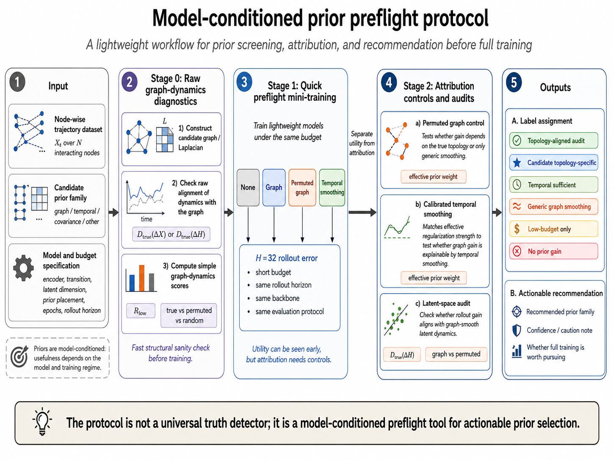
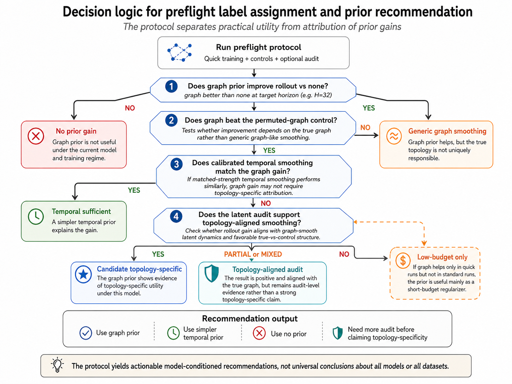

# Draft Methods

## Problem Formulation

We consider node-wise physical or scientific trajectory data represented as `X_{1:T}`, where each frame `X_t in R^{N x d}` contains `d` observed features for each of `N` nodes. A dataset adapter provides these trajectories, a candidate graph or graph Laplacian `L in R^{N x N}`, and metadata describing the graph source, topology, simulator or data source, and whether the graph is known, approximate, or data-derived. The prediction model maps observed node states into learned latent node states `H_t in R^{N x m}` and trains a transition model to predict future dynamics. Rollout quality is evaluated over specified horizons, for example H=16 or H=32.

The preflight problem is to decide, before full-scale training, whether an auxiliary prior should be used for a particular model condition. We define a model condition as the complete set of choices that can affect prior behavior: encoder architecture, transition model, latent dimension, prior placement, optimizer and training settings, prior strength, training budget, and rollout evaluation horizon. A preflight recommendation is therefore not a dataset-level statement. It applies only under the tested model condition and should be revisited if the encoder, transition model, prior location, regularization strength, training duration, or evaluation horizon changes.

The central question is:

> Under this model condition and training budget, does a candidate prior improve rollout prediction, and is the improvement better attributed to candidate topology, generic graph-frequency smoothing, graph-free temporal smoothing, or a low-budget regularization effect?

This framing deliberately avoids causal graph discovery and avoids asserting that a candidate graph is physically true. The purpose is computational triage: reduce wasted full training, avoid false topology attribution, and choose among no prior, graph prior, temporal smoothing, or audit mode.

Figure 1 summarizes the proposed model-conditioned preflight protocol, while Figure 2 specifies the downstream decision logic used to separate practical prior utility from topology-specific attribution.

<a id="fig-preflight-protocol"></a>


Figure 1. Overview of the model-conditioned prior preflight protocol. Given node-wise trajectories, candidate priors, and a fixed model/budget specification, the protocol runs lightweight diagnostics and controlled mini-training comparisons before assigning an actionable recommendation. The workflow is explicitly model-conditioned: its recommendation applies to the tested encoder, transition model, prior placement, prior strength, training budget, and rollout horizon.

## Prior Families and Controls

The baseline condition is `none`, in which the latent dynamics model is trained without an auxiliary prior. The candidate graph prior is a graph Laplacian smoothness penalty applied to learned node-wise latent states. For a latent matrix `H`, the graph penalty is

```math
R_G(H; L) = Tr(H^T L H).
```

Let `L = U Lambda U^T` be the eigendecomposition of the Laplacian, and write `H = U A`, where row `a_k` of `A` gives the latent coefficient associated with graph-frequency eigenvector `k`. Then

```math
Tr(H^T L H) = Tr(A^T Lambda A) = sum_k lambda_k ||a_k||_2^2.
```

This expression shows that the Laplacian prior is a graph-frequency smoothing penalty: high-frequency components with larger `lambda_k` are penalized more strongly. A gain from this penalty may indicate useful candidate topology, but it may also indicate generic graph-frequency smoothing. The protocol therefore requires controls before assigning topology-specific interpretations.

The main topology control is a spectrum-matched permuted graph. Let `P` be a permutation matrix. The permuted control Laplacian is

```math
L_perm = P^T L P.
```

This transformation preserves the eigenvalues of `L`, and therefore preserves the graph-frequency penalty scale, while changing the association between node identities and graph structure. If the candidate graph prior improves over no-prior training but does not improve over this permuted control, the evidence supports generic graph smoothing rather than node-label-specific topology. An optional random graph control can also be included. Random controls are useful secondary baselines, but they are weaker attribution controls because they may not match the full Laplacian spectrum.

The graph-free temporal prior penalizes rapid changes in learned node-wise latent states without using a graph. A representative form is

```math
R_T(H_{1:T}) = sum_t ||H_{t+1} - H_t||_F^2.
```

This baseline asks whether the graph prior is needed at all, or whether temporal smoothing alone explains the observed gain. The temporal prior is especially important because graph-prior benefits in rollout prediction can reflect smoother latent evolution rather than graph-specific structure.

## Strength Calibration

Different prior families can have very different raw loss scales. In particular, the uncalibrated temporal smoothness loss can be orders of magnitude smaller than the graph Laplacian loss, so using the same nominal prior weight can make the temporal baseline artificially weak. The preflight protocol therefore calibrates unlike prior families by matching their initial effective regularization contribution.

Let `alpha_G` be the candidate graph prior weight, and let `R_G^0` and `R_T^0` denote initial prior losses measured under the same model initialization or calibration pass. The temporal prior weight can be chosen as

```math
alpha_T = alpha_G R_G^0 / (R_T^0 + epsilon),
```

so that

```math
alpha_T R_T^0 approx alpha_G R_G^0.
```

The calibration does not assert that graph and temporal priors are equivalent. It only ensures that the comparison asks a fairer computational question: at matched initial regularization strength, does the graph prior outperform graph-free temporal smoothing? If calibrated temporal smoothing matches or beats the graph prior, the protocol recommends temporal smoothing or further controls rather than topology attribution.

## Preflight Modes

The protocol has three operating modes.

Quick mode uses a small training budget, such as a short epoch count and limited transition windows. Its purpose is to screen whether any prior is useful as a low-cost regularizer. A positive quick-mode graph result is a reason to continue testing, not a reason to claim topology specificity.

Standard mode uses a larger training budget under the same model condition. Its purpose is to test persistence. Some priors help early because they regularize optimization or stabilize low-budget rollout, but the advantage can disappear when the no-prior model has more training time. When quick-mode gains do not persist, the protocol marks the effect as low-budget-only.

Audit mode saves latent traces or checkpoints and evaluates learned latent geometry. Given latent states `H_t`, the audit computes temporal deltas `Delta H_t = H_{t+1} - H_t` and measures graph smoothness, such as `Tr((Delta H)^T L Delta H)`, under the candidate and control graph bases. It can also measure low-frequency energy ratios in the candidate graph eigenbasis. Audit evidence supports topology-aligned latent smoothing only when rollout improvements agree with smoother or more low-frequency latent temporal deltas on the candidate graph. Audit mode is not assumed to be available in every run; it requires saved latent artifacts.

## Decision Labels and Recommendations

The preflight report assigns labels that are intended to guide computational action. `no_prior_gain` means that no tested prior meaningfully improves over no-prior training; the recommendation is to skip the prior for larger runs unless there is another scientific reason to test it. `graph_generic_smoothing` means that the graph prior improves over no-prior training but does not beat spectrum-matched or other smoothing controls; the recommendation is to avoid topology claims and consider whether generic smoothing is sufficient. `temporal_smoothing_sufficient` means that calibrated temporal smoothing matches or beats the graph prior; the recommendation is to use the temporal prior unless graph attribution is itself the scientific question.

<a id="fig-decision-logic"></a>


Figure 2. Decision logic for assigning preflight labels and prior recommendations. The tree separates practical utility from topology-specific attribution by comparing graph-prior rollout performance against no-prior baselines, spectrum-matched permuted graph controls, calibrated temporal smoothing, and optional latent-space audits. Positive graph-prior performance alone is therefore not treated as sufficient evidence of topology-specific structure.

`candidate_topology_specific` means that the candidate graph prior beats no-prior training, the spectrum-matched permuted graph, and calibrated temporal smoothing under the tested budget. This label supports carrying the graph prior forward, but it remains model-conditioned and does not prove that the graph is the true physical interaction graph. `topology_aligned_latent_smoothing` adds audit evidence: learned temporal deltas are smoother or more low-frequency in the candidate graph basis when the graph prior is used. `low_budget_only` is assigned when a prior helps in quick mode but loses the advantage under standard or longer training. `overconstrained` indicates that a prior appears to harm rollout, likely by suppressing useful latent variation. `inconclusive` is used when controls, audits, or repeated runs are insufficient for a stronger label.

These labels are intentionally conservative. A graph prior must beat no-prior training to be useful, beat a spectrum-matched permuted graph to support topology-specific attribution, and beat calibrated temporal smoothing to show value beyond graph-free temporal regularization. Stronger topology-aligned claims require audit evidence.
